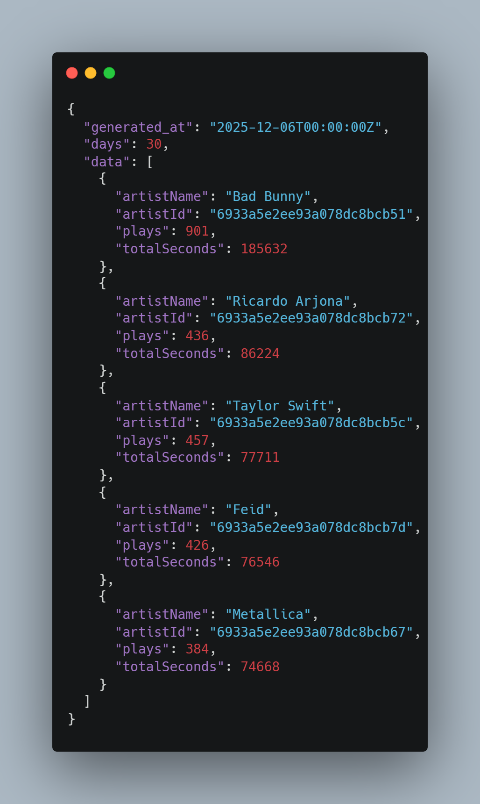
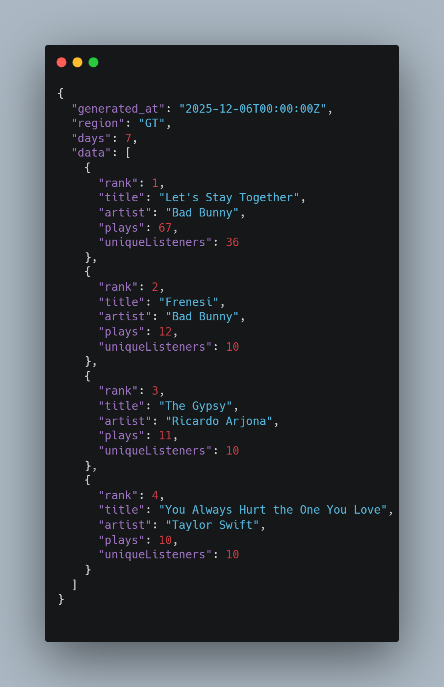
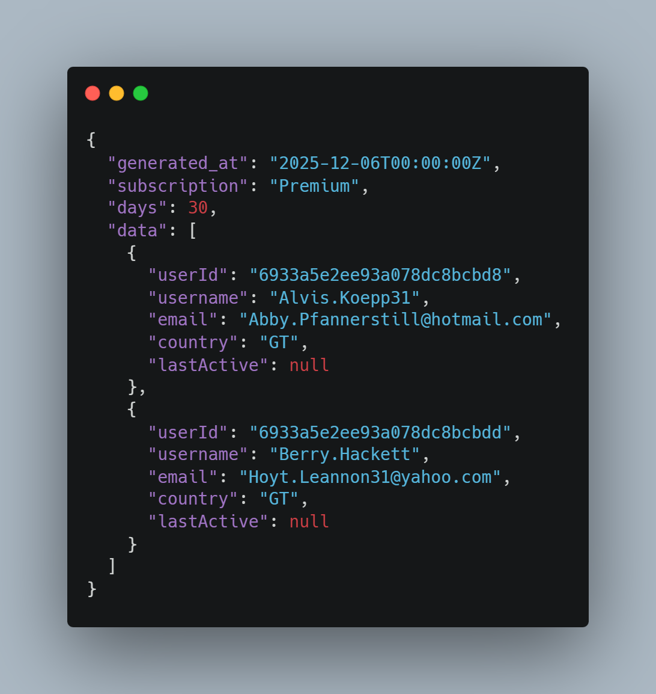
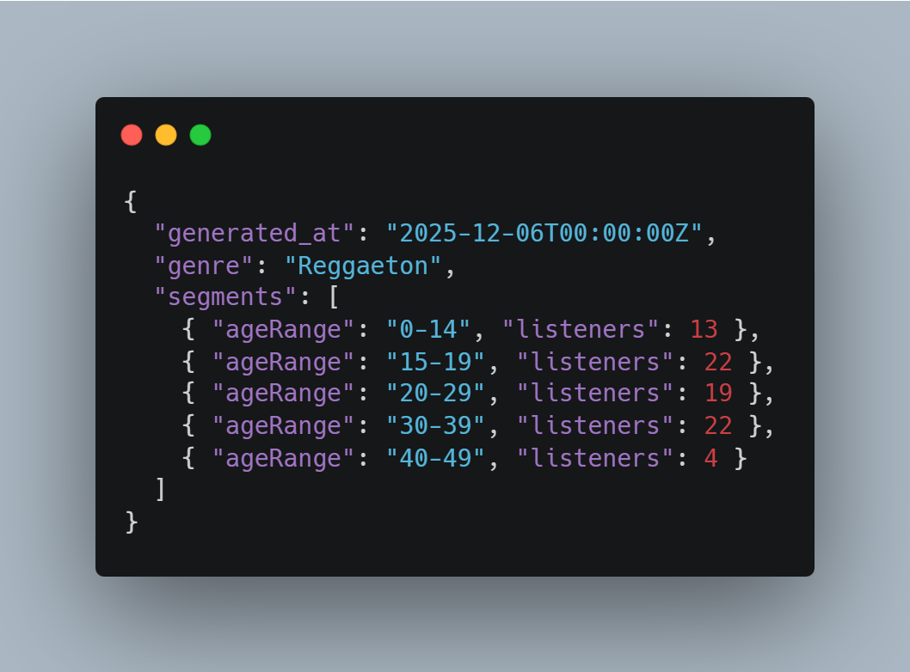
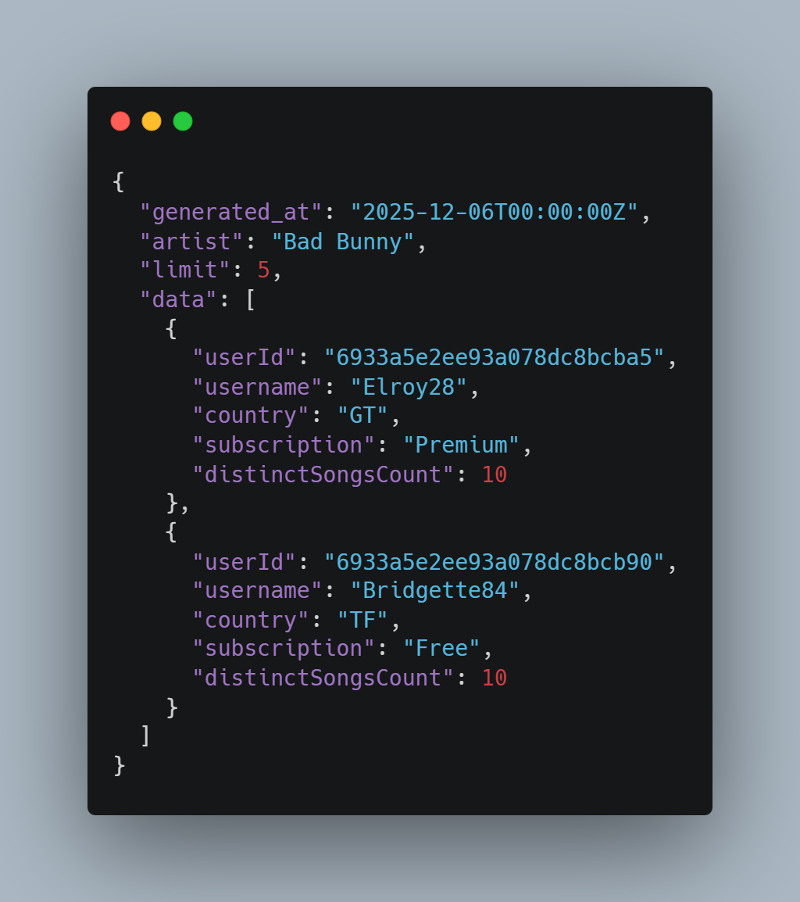
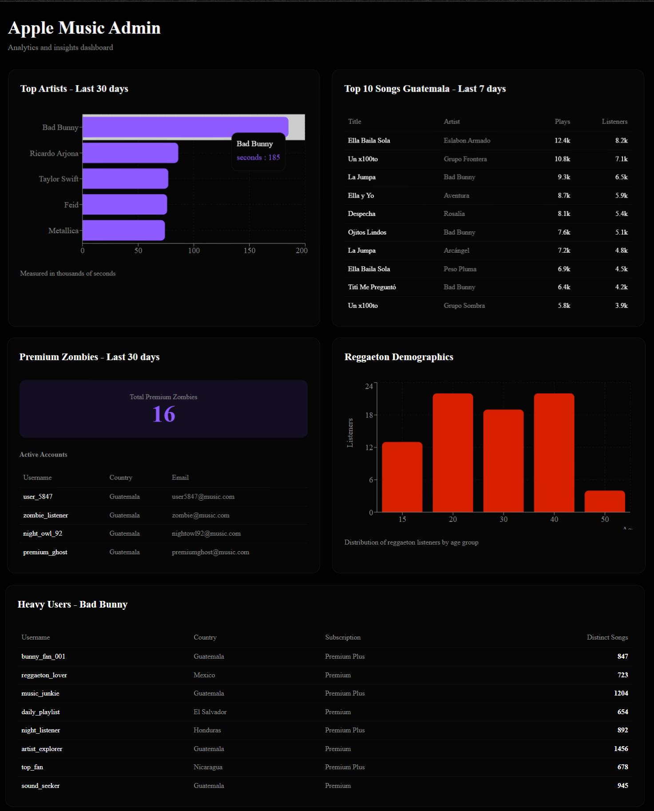

# API Specification – Apple Music Case

Este documento define los 5 endpoints JSON que permitirían consumir los datos del dashboard de análisis de Apple Music. Cada endpoint devuelve información lista para visualización, basada en las agregaciones realizadas en la base de datos. Los parámetros permiten filtrar los resultados por días, región y otros criterios según el caso.

---

## 1. Top Artists (últimos 30 días)
**GET** `/api/charts/top-artists?days=30`

**Descripción:**  
Devuelve los artistas más escuchados en la plataforma durante los últimos 30 días, ordenados por tiempo total reproducido en segundos. Este endpoint se usa para calcular regalías y detectar tendencias generales de la plataforma.

**Query Params:**  
- `days` (number) – Rango de tiempo en días.

**Ejemplo de respuesta JSON:**
```json
[
  {
    "artistName": "Bad Bunny",
    "totalSeconds": 185632,
    "plays": 901
  },
  {
    "artistName": "Ricardo Arjona",
    "totalSeconds": 86224,
    "plays": 436
  }
]
```



---

## 2. Top Songs por Región (últimos 7 días)
**GET** `/api/charts/top-songs?region=GT&days=7`

**Descripción:**  
Devuelve el Top 10 de canciones más reproducidas en una región específica durante los últimos 7 días. Este endpoint permite identificar tendencias regionales y preferencias locales para estrategias de marketing.

**Query Params:**  
- `region` (string) – Código del país (ej: GT).  
- `days` (number) – Rango de tiempo.

**Ejemplo de respuesta JSON:**
```json
[
  {
    "title": "Let's Stay Together",
    "artist": "Bad Bunny",
    "plays": 67,
    "uniqueListeners": 36
  },
  {
    "title": "Frenesi",
    "artist": "Bad Bunny",
    "plays": 12,
    "uniqueListeners": 10
  }
]
```



---

## 3. Usuarios Premium Inactivos (30 días)
**GET** `/api/users/inactive-premium?days=30`

**Descripción:**  
Devuelve los usuarios con suscripción Premium que no han reproducido ninguna canción durante los últimos 30 días. Este endpoint sirve para análisis de retención, churn y campañas de reactivación.

**Query Params:**  
- `days` (number) – Rango para medir inactividad.

**Ejemplo de respuesta JSON:**
```json
[
  {
    "username": "Alvis.Koepp31",
    "email": "Abby.Pfannerstill@hotmail.com",
    "country": "GT",
    "subscription": "Premium",
    "lastActive": null
  },
  {
    "username": "Guiseppe_Orn",
    "email": "Novella_Wunsch@gmail.com",
    "country": "GT",
    "subscription": "Premium",
    "lastActive": null
  }
]
```



---

## 4. Distribución por Edad de Listeners de Reggaeton
**GET** `/api/charts/reggaeton-age-distribution`

**Descripción:**  
Devuelve la distribución de edad de los usuarios que escucharon canciones del género Reggaeton. Permite segmentar demográficamente a la audiencia real del género y diseñar campañas de promoción enfocadas.

**Query Params:**  
Sin parámetros.

**Ejemplo de respuesta JSON:**
```json
[
  { "range": "0-15", "count": 13 },
  { "range": "15-20", "count": 22 },
  { "range": "20-30", "count": 19 },
  { "range": "30-40", "count": 22 }
]
```



---

## 5. Top Fans de Bad Bunny
**GET** `/api/charts/top-fans?artist=Bad%20Bunny`

**Descripción:**  
Devuelve los 5 usuarios con más variedad de canciones escuchadas de un artista específico. Este endpoint es útil para identificar a los fans más activos y segmentar promociones directas.

**Query Params:**  
- `artist` (string) – Nombre del artista.

**Ejemplo de respuesta JSON:**
```json
[
  {
    "username": "Elroy28",
    "country": "GT",
    "subscription": "Premium",
    "distinctSongsCount": 10
  },
  {
    "username": "Bridgette84",
    "country": "TF",
    "subscription": "Free",
    "distinctSongsCount": 10
  }
]
```



---

## Notas Finales

Todos los endpoints devuelven un JSON listo para consumo de dashboards o aplicaciones internas. Los parámetros permiten cambiar el rango de días o región sin modificar la consulta base. Las imágenes PNG asociadas muestran la forma en que los datos se visualizan en el prototipo de dashboard.


## 6. Apple Music Admin Dashboard

Descripción:
El dashboard fue generado utilizando v0.dev (AI UI Prototyping) sobre una interfaz web en Next.js, tomando como referencia los datos reales provistos por la base de datos MongoDB. El objetivo del dashboard es mostrar de forma visual y simple los resultados de las cinco consultas analíticas desarrolladas con Aggregation Pipelines.

Cada sección del dashboard representa un caso de análisis típico dentro de plataformas de streaming musical. De esta manera, permite observar patrones de comportamiento, consumo y retención de usuarios, así como el impacto económico de la música por artista y por región.

A nivel visual, utiliza componentes modernos con gráficas de barras, tablas comparativas, indicadores y métricas resumidas, con un diseño minimalista y orientado a decisiones de negocio.

